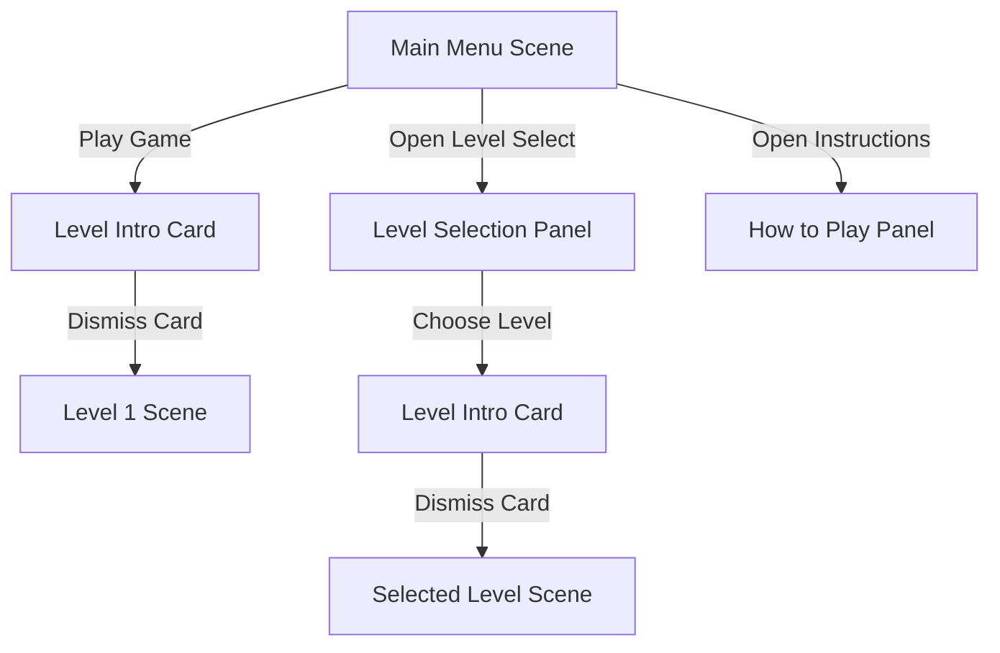

# UX Proposals: Splat & Span (Germ Patrol)
## Production-Grade Game Feel, Juice & Interface Design

This document details the user experience (UX), interface layouts, visual feedback, and "game feel" (juice) proposals for the Micro-Janitor combat system and menu flow.

---

## 1. Heads-Up Display (HUD) Architecture

**HUD** stands for **Heads-Up Display**. It is the screen-space graphical UI overlay displayed on top of the gameplay viewport, presenting real-time stats and item counts without forcing the player to open menus or blocking the action.

```
+-------------------------------------------------------------+
| [HP/Shield/Heat Bars]   [Active Weapon/Allies]   [C/O2/Score]|
|  - Health (Magenta)       - Foam (Left-Click)      - Carbon   |
|  - Shield (Teal)          - Solvent (Right-Click)  - Oxygen   |
|  - Vacuum (Orange)        - Bleach Indicator (Q)   - Score    |
|                           - Friends (Lymp/WBC)               |
|                                                             |
|                         (Crosshair)                         |
|                                                             |
|                            (Player)                         |
|                                                             |
+-------------------------------------------------------------+
```

### A. Screen-Space HUD (Unified Top Bar)
*   **Top-Left (Metrics Panel):** Stacked horizontal gauges. 
    *   **Shield:** Neon electric-teal bar. Glows with a shifting light frequency when active.
    *   **Health:** Vibrant magenta bar sitting directly underneath the Shield.
    *   **Vacuum Heat:** Orange thermometer-style bar under the Health slider. Fills while holding the Spacebar, entering a flashing red lockout (overheat) state if held for 4+ seconds.
*   **Top-Center (Combat & Allies Panel):**
    *   **Active Weapon Icon:** A circular chemical canister display. Firing is determined instantly by click:
        *   Idle (neither clicked): Weapon icon is dimmed.
        *   Left-Click held: Highlight the **Sanitization Foam** (soap bubble) icon.
        *   Right-Click held: Highlight the **Solvent Spray** (green spray bottle) icon.
        *   Bleach Fully Charged (100%): The **Concentrated Bleach** canister icon (Q key) flashes bright yellow with electricity.
    *   **Friend Icons:** Small cell portraits representing Lymphocyte (Level 1) and WBC Tank (Level 2). They remain translucent gray until rescued, turning bright green and glowing when active.
*   **Top-Right (Resources & Score Panel):**
    *   **Element Canisters:** Stylized icons showing Carbon (C) and Oxygen (O2) fill states. Text overlays show current stock against dynamic maximum limits (e.g., `C: 45 / 80` and `O2: 12 / 40`) to represent backpack capacities clearly.
    *   **Bio-Matter (BM) Counter:** Displays accumulated score, rolling digits upward like an odometer when points are collected.

### B. Aiming Crosshair & Target Assist
*   **Dynamic Laser Guide:** A subtle dotted alignment line projects from Buster's nozzle to the crosshair.
    *   *Left-Click (Foam):* Guide line is neon cyan.
    *   *Right-Click (Solvent):* Guide line shifts to acidic yellow-green.
    *   *Out of Element fuel / Overheat Lockout:* Guide line blinks red, nozzle plays a deflated "pffff" clicking sound.
*   **Target Hitmarkers:** Micro bubble-pop splat shapes flash on the target when projectiles hit.

### C. Gameplay Visual Mockup
[Gameplay Interface Mockup (Top HUD, Buster spraying foam, and pathogen blobs)](file:///C:/Users/ayushi/.gemini/antigravity/brain/7aa2a0b1-ca0a-490e-a669-2a5378b5e66c/gameplay_ux_mockup_1779547321061.png)

### D. Camera Viewport & Level Scrolling Feel
Since the levels are significantly larger than a single screen viewport, the player's view smoothly scrolls:
*   **Cinemachine 2D Camera Follow:** The camera tracks Buster with a soft damping effect (0.2 damping on X and Y) to make movement feel fluid.
*   **Camera Dead Zone:** A small 1.5 x 1.5 unit central dead zone is enabled. Buster can move slightly within this window without shifting the camera, eliminating minor jitter.
*   **Level Bound Confiner:** A CinemachineConfiner2D component uses the level's edge colliders to block the camera from ever scrolling past the outer edges of the level boundaries, keeping the viewport inside the play zone.
*   **Auto-Scrolling Camera (Level 2 Lungs):** Viewport scrolls upward automatically at a constant speed (2.2 units/sec). A red "warning line" appears at the bottom edge. Crossing below this edge into the bottom kill plane results in instant fatal damage.

---

## 2. Sensory Feedback ("Juice" / Game Feel)

Satisfying tool operation is core to player engagement.

### A. Sound Effects (SFX) Spec
*   **Sanitization Foam Spray:** Soft, wet, bubbly "pfft-sputter" loops. Bubble popping on targets: high-frequency tiny "plip/plop" sounds.
*   **Solvent Spray:** High-pressure continuous liquid hiss combined with an acidic sizzling/fizzing sound.
*   **Vacuum Suction:** Low mechanical motor hum that scales up in pitch as objects draw closer, ending in a wet suction "shloop" when items are consumed.
*   **Vacuum Overheat:** A harsh buzzer sound ("BZZT-BZZT") followed by steam venting ("HSSSSS").
*   **Shield Pop / Deflect:** Shimmering glass chime on deflection; loud bubble burst pop when shield breaks.
*   **Buster Damage:** Squeaky dog-toy rubber squish sound on health damage.
*   **Backpack Upgrade Pick-up:** Heavy mechanical metallic clamping sound followed by a dynamic pressurized steam release hiss ("CLANG-PFFT!").
*   **Fanfares:** Short 8-bit biological jingle for ally rescues, major upbeat melody for level completion.

### B. The Vacuum Cleaner Visuals & Tactiles
*   **Visuals:** Inward-swirling vector wind lines draw from the environment toward Buster's nozzle. Small assets (Carbon/Oxygen atoms, mini-amoebas) stretch slightly along the pull axis (squash-and-stretch).
*   **Tactile (Screenshake):** A constant micro-rumble/shake that intensifies when larger objects or mini-enemies are sucked inside.

### C. Sanitization Foam
*   **Visuals:** Shoots puffy, volumetric white spheres that expand upon impact. When hitting pathogens, it coats them in a sudsy, dripping white layer to show the 30% speed debuff.
*   **Decay:** Foam bubbles left on the floor linger for 3.0 seconds, popping individually with micro-sparks before disappearing.

### D. Solvent Spray (Acid Beam)
*   **Visuals:** A continuous stream of high-pressure green chemical particles. Hitting obstacles (like Cholesterol Gates or Phase 2 boss walls) creates fizzing, glowing sparks and green steam clouds.
*   **Screenshake:** A steady horizontal screenshake during continuous spray.

### E. Combat Damage & Wall Cracking Indicators
*   To keep the viewport premium and clean, standard pathogens do *not* have floating health bars:
    *   **Hit Flash:** Pathogens flash solid white when struck.
    *   **Shrinkage:** Pathogens shrink in size as their HP decreases (representing loss of mass).
    *   **Critical State:** Pathogens pulse dark red and emit dripping cytolytic particles when below 30% HP.
*   **Destructible Walls & Cages:**
    *   Do not have health bars.
    *   Use a **Cracking visual feedback system**: progress through three distinct sprites (Healthy, Cracked, Crumbling) to communicate structural damage.
    *   Foam projectiles bounce off boss walls and Cholesterol gates with rubbery squeak sounds, doing zero damage.

### F. Buster's Damage Response
*   **Visuals:** When Buster's Shield is broken, the shield bubble pops in a circle of electric teal sparks. If health is damaged, Buster squishes flat, flashes white, and his blue cap spins off and lands back on his head.

### G. Backpack Capacity Upgrade Pick-up
*   **Visuals:** A double-cylinder metal canister wrapped in glowing cyan and pink bands. When Buster rolls over it, the canister expands horizontally, flashes white, and floats a "+CAPACITY UPGRADED!" glowing yellow text upward.
*   **Inventory Glow:** The Carbon and Oxygen bar frames on the top-right HUD flash bright yellow for 1.0 second as their physical widths scale wider to visually represent the new, expanded capacity limit.
*   **No Refill Rule:** Current element quantities remain unchanged during the upgrade. The player will see the maximum values increase (e.g. `40 / 60` to `40 / 80`), indicating they must harvest to fill the newly unlocked tank space.

### H. Molecular Recyclers (Level 4 Boss Arena)
*   **Visuals:** Two stationary, glowing biological valve nodes located in the top-left and top-right corners of the Boss Arena. Every 15 seconds, they expand and release a cluster of 5 Carbon (blue-silver) and 3 Oxygen (coral-pink) droplets. The player can stand near them or use the Spacebar vacuum to pull these elements in to refuel mid-fight.

---

## 3. Menu Transitions & Visual Routing

Menus are designed to feel like part of the organic biological environment.



### A. Level Intro Dialog (Briefing Card)
When loading any level:
1.  Gameplay is paused, and a semi-translucent biological card fades onto the center of the screen.
2.  **Left side of card:** A microscope-style circular animation showing the level environment.
3.  **Right side of card:** Briefing text.
    *   *Level 1:* "PETRI-DISH PRIMORDIAL - Objective: Traverse the agar maze and rescue the Lymphocyte Friend. Tip: Avoid Petri Acid pools, or use Spacebar to vacuum elements out of them! Keep an eye out for dynamic Backpack Upgrades!"
    *   *Level 2:* "RESPIRATORY SPORE-FIELDS - Objective: Climb the airways. Watch out for the rising alveolar acid floor and wind zones! Tip: Rescue the WBC Tank friend and search airway alcoves for a Backpack Upgrade!"
    *   *Level 3:* "CAPILLARY EXPRESSWAY - Objective: Navigate split vessel paths. Tip: The bottom lane has a heavy Cholesterol Gate. Melt it with Solvent Spray to find a Backpack Upgrade and Fusion Core!"
    *   *Level 4:* "BOSS ARENA: PARASITE CORE - Objective: Destroy the mutated core. Tip: Use Solvent to dissolve shields and walls. Refuel your elements using the Molecular Recyclers in the top corners!"
4.  **Dismiss Button:** A glowing button labeled "START MISSION". Clicking it plays a bubble-pop sound, fades the card, and resumes gameplay.

### B. Game Over & Victory Canvas overlays
*   **Game Over (Defeated Panel):** Fades in a dark magenta overlay. Displays a cracked backward cap graphic, Buster's flat silhouette, final Bio-Matter score, and two glowing buttons:
    *   `RETRY MISSION` (Wipes level state, reloads current level).
    *   `RETREAT TO MENU` (Saves high scores, returns to Main Menu).
*   **Victory Panel:** Fades in a bright electric teal overlay. Displays a sparkling backward cap graphic, Buster striking a pose, total Bio-Matter score, and buttons:
    *   `NEXT MISSION` (Loads next level; disabled in Level 4).
    *   `REPLAY` (Reloads current level, resets inventory/allies/capacities to defaults).
    *   `MAIN MENU` (Returns to Menu).

### C. Panel Transitions & Button Interactions
*   Clicking buttons triggers a **Chemical Wipe Transition** — a green solvent/foam wash across the screen.
*   **Button Hover State:** Buttons wiggle like cell membranes, play a quiet bubble-pop sound, and grow slightly.
*   **Replay Restrictions:** Selecting a level from the Level Select screen resets inventory, max capacities, and rescued friend counts. Replaying Level 1 does *not* stack Bio-Matter into a persistent global wallet, nor does it allow spawning multiple Lymphocytes. The previous high score is overwritten if the new score is higher.

### D. Level Selection UI
*   Levels are represented as floating glass Petri dishes containing colored liquid matching the stage's setting:
    *   *Level 1:* Bright green agar gel.
    *   *Level 2:* Glowing purple mucosal bubbles.
    *   *Level 3:* Dark crimson flowing blood cell streams.
    *   *Level 4:* Shifting violet chromatin core.
*   Locked levels are shown wrapped in thick, brown structural cell tissue. When unlocked, Buster's spray hose automatically dissolves the tissue, revealing the clear Petri dish.

### E. Main Menu Visual Mockup
[Main Menu Interface Mockup (Game title, buttons, and microbial background)](file:///C:/Users/ayushi/.gemini/antigravity/brain/7aa2a0b1-ca0a-490e-a669-2a5378b5e66c/main_menu_ux_mockup_1779547339821.png)
